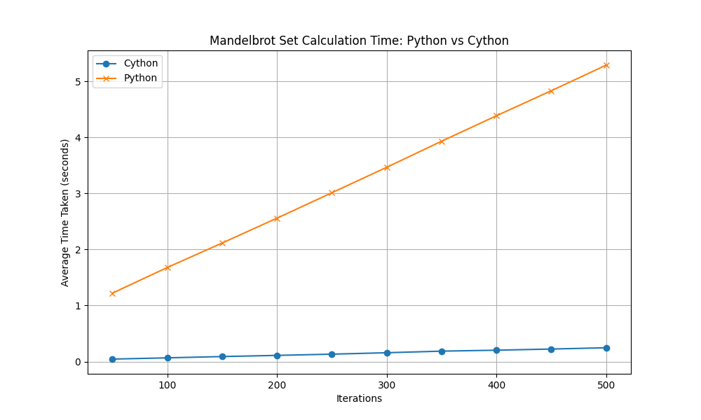

# EE2-Project

This is branch is dedicated to the Cython and Python implementations of the Mandelbrot Set visualisation. It is designed to set a benchmark for which our hardware implementation should beat as to justify our system design.

### How to run the benchmark:

1. Run [the Cython benchmark](Cython_Benchmark/benchmark_mandelbrot.py) this should generate a .csv file upon completion

2. Do the same for [the Python benchmark](Python_Benchmark/benchmark_mandelbrot.py)

3. Finally run the [analysis.ipynb](analysis.ipynb) Juypter Notebook. This will take the results from both benchmarks to create a final graph and output image

E.g:

